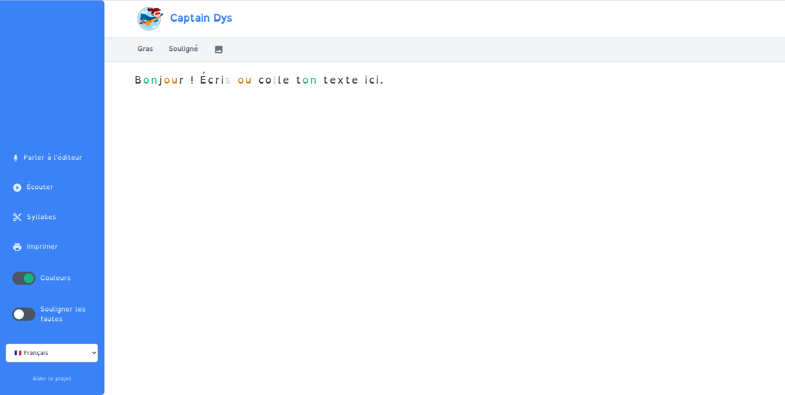

# Captain Dys

[captaindys.com](https://captaindys.com/). A web editor for (french for the moment) dyslexic child.



## Installation

```bash
yarn install
npm run build
```

## Contributing

In order to work locally, run:

```bash
yarn install
npm run serve --mode=development
```

## Author

+ Jean-François Lépine <[@Halleck45](https://twitter.com/Halleck45)>

## License

See the [LICENSE](LICENSE) file.
