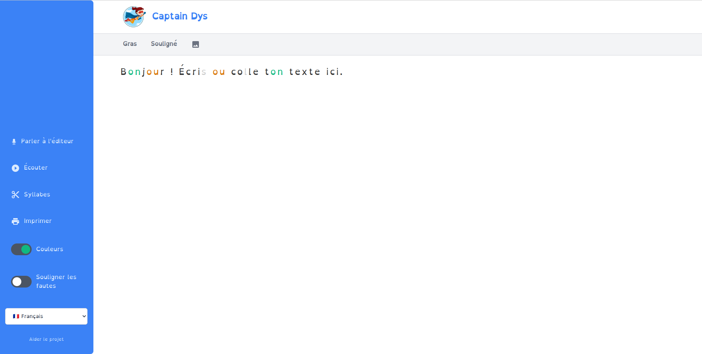

# Captain Dys

[captaindys.com](https://captaindys.com/). A web editor for dyslexic children (available in French and English).



## Features

**Implemented:**

+ ✅ text editor
+ ✅ colour of phonemes (*French and English supported. Needs your help for other languages*)
+ ✅ image recognition (*image to text*)
+ ✅ text to speech
+ ✅ speech to text

**Needs help for:**

+ 💁 colour of phonemes (for other languages)

**Roadmap:**

+ 🚧 text simplification (with AI)


## Installation

```bash
yarn install
yarn build
```

## Contributing

In order to work locally, run:

```bash
yarn install
yarn serve --mode=development
```

Remember to run [Jest tests](https://jestjs.io/) with:

```bash
yarn install
yarn test
```

## Localization and translations

Do not hesitate to contribute to the project by adding your locale:

+ Copy the `src/locales/fr-FR.js` file to `src/locales/xx.json` (where xx is your locale code)
+ Import it in `src/locales/index.js`

## Author

+ Jean-François Lépine <[@Halleck45](https://twitter.com/Halleck45)>

## License

See the [LICENSE](LICENSE) file.
